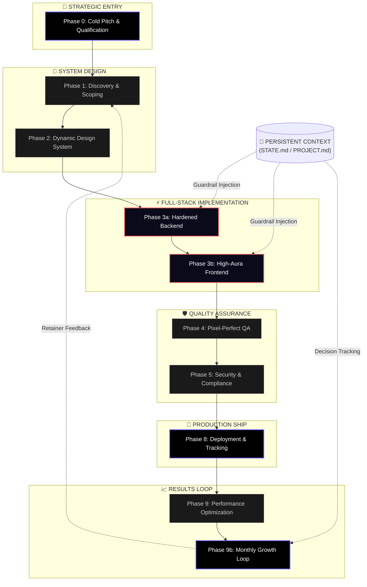

# Web Agency Skill (WSA) — The Full-Stack Pro Framework

A senior-level, spec-driven, and agent-agnostic operating system designed for solo developers and agency partners to orchestrate high-fidelity web projects with absolute precision.


---

## ⚡ Quickstart (30 Seconds)

1. **Clone**: `git clone https://github.com/Rav-xyl/Web-Agency-Skill`
2. **Ingest**: Point your AI assistant (Claude, Cursor, Windsurf) to the repo root.
3. **Initialize**: Type `/wsa:init` to bootstrap your professional project lifecycle.

---

## 🎭 The Mindset: Senior Full-Stack Partner
Unlike generic prompts, **WSA** codifies the standards of a senior professional. It mandates normalized database schemas, hardened API contracts, and high-aura cinematic UI/UX. It operates with a **Zero Placeholder Tolerance** policy—if it's in the repo, it's production-ready.

---

## 🏛️ GSD Architecture (Lifecycle)

The WSA operating system follows a strict, spec-driven lifecycle to ensure **Architectural Integrity** and prevent **Context Rot**.




---

## 📂 Repository Blueprint

```text
.
├── .claude/
│   └── skills/
│       └── wsa/
│           ├── assets/       # State schemas & operational assets
│           ├── commands/     # Precision action logic (/wsa:init, /wsa:plan)
│           ├── references/   # Hardened knowledge (Security, Aura, Backend)
│           └── SKILL.md      # The Brain (Central orchestrator)
├── .cursor/
│   └── rules/                # Native IDE guardrails (.mdc)
├── AGENTS.md                 # Global operational standards
├── CLAUDE.md                 # Model-specific expert overrides
└── README.md                 # Senior Partner Manifesto
```

---

## 🛠️ Operational Router

Point your AI assistant to this root and trigger the skill:
> "Ingest the Web Agency Skill. Read AGENTS.md and initialize Phase 1."

| Command | Action |
| :--- | :--- |
| `/wsa:init` | Bootstrap a fresh professional project. |
| `/wsa:audit` | Ingest legacy code and create a recovery roadmap. |
| `/wsa:plan [N]` | Generate atomic XML task specs for Phase N. |
| `/wsa:execute` | Run surgical, one-task-per-commit development waves. |
| `/wsa:verify` | Execute the pro-level QA and fix queue. |

---

## 🛡️ Pro Modules Included
- **[High-Aura UI/UX](./.claude/skills/wsa/references/aura.md)**: Cinematic motion and visual depth standards.
- **[Backend Integrity](./.claude/skills/wsa/references/backend.md)**: DB normalization and API hardening patterns.
- **[Security & legal](./.claude/skills/wsa/references/security.md)**: OWASP standards and GDPR compliance.

---

## 🚫 What This Is NOT
- **It is NOT a CLI tool**: It is a collection of logic and references that your AI assistant uses to guide its own CLI usage.
- **It is NOT a SaaS**: It's an open-source framework for building high-end client projects.
- **It is NOT a "Prompt"**: It's a structured operating system with state management and automated gates.

---

## 📄 License
Licensed under the **MIT License**. Build something legendary.
